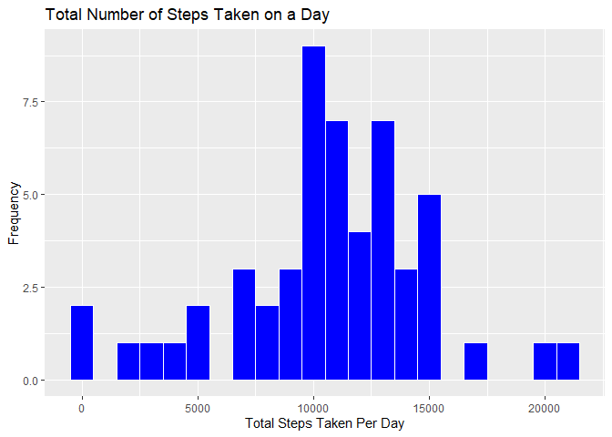
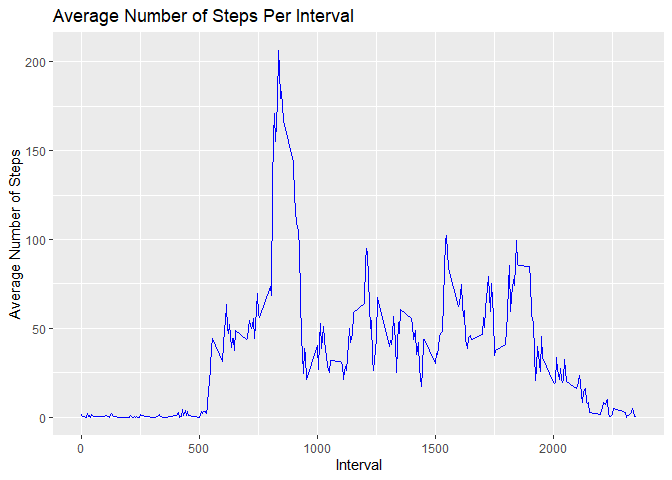
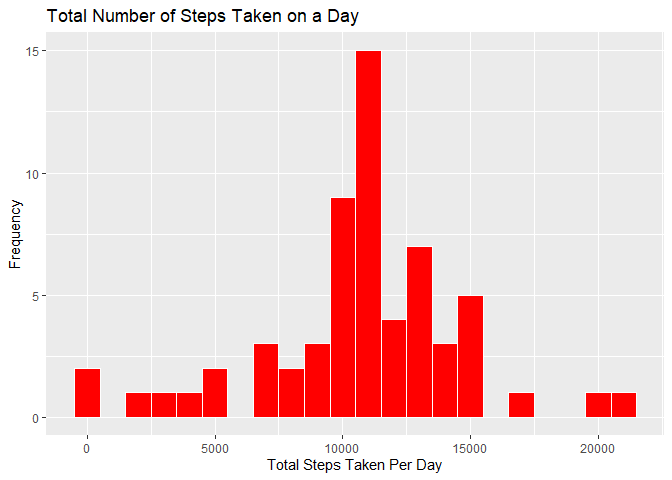
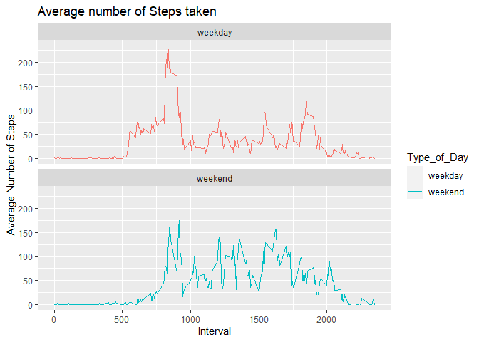

## Loading and preprocessing the data


```r
library(ggplot2)

#Url of the data 
FileUrl<-"https://d396qusza40orc.cloudfront.net/repdata%2Fdata%2Factivity.zip"

download.file(FileUrl,destfile = "activity_data.zip")

# unzip the file
unzip("activity_data.zip")

activity<-read.csv("activity.csv")

# Viewing the processed data
summary(activity)
```

```
##      steps            date              interval     
##  Min.   :  0.00   Length:17568       Min.   :   0.0  
##  1st Qu.:  0.00   Class :character   1st Qu.: 588.8  
##  Median :  0.00   Mode  :character   Median :1177.5  
##  Mean   : 37.38                      Mean   :1177.5  
##  3rd Qu.: 12.00                      3rd Qu.:1766.2  
##  Max.   :806.00                      Max.   :2355.0  
##  NA's   :2304
```


```r
new_activity_data<-na.omit(activity)
summary(new_activity_data)
```

```
##      steps            date              interval     
##  Min.   :  0.00   Length:15264       Min.   :   0.0  
##  1st Qu.:  0.00   Class :character   1st Qu.: 588.8  
##  Median :  0.00   Mode  :character   Median :1177.5  
##  Mean   : 37.38                      Mean   :1177.5  
##  3rd Qu.: 12.00                      3rd Qu.:1766.2  
##  Max.   :806.00                      Max.   :2355.0
```

## What is mean total number of steps taken per day?


```r
Total_steps<-aggregate(new_activity_data$steps,by=list(new_activity_data$date),sum)
names(Total_steps)<-c("date","steps")
head(Total_steps)
```

```
##         date steps
## 1 2012-10-02   126
## 2 2012-10-03 11352
## 3 2012-10-04 12116
## 4 2012-10-05 13294
## 5 2012-10-06 15420
## 6 2012-10-07 11015
```
Plotting a histogram plot

```r
ggplot(Total_steps, aes(x = steps))+
  geom_histogram(color = "white",fill="blue",binwidth = 1000)+
  ggtitle("Total Number of Steps Taken on a Day")+
  xlab("Total Steps Taken Per Day") + 
  ylab("Frequency") 
```

<!-- -->
Calculate the mean and median of the total number of steps taken per day

```r
print(paste("mean: ",round(mean(Total_steps$steps),digits = 2)))
```

```
## [1] "mean:  10766.19"
```

```r
print(paste("median: ",median(Total_steps$steps)))
```

```
## [1] "median:  10765"
```
## What is the average daily activity pattern?


```r
#calculting average steps taken across all gays by 5-min intervals.
Average_steps<-aggregate(new_activity_data$steps,by=list(new_activity_data$interval),mean)
names(Average_steps) <- c("interval", "steps")
#head(Average_steps)
# Plotting time series of the 5-min interval
ggplot(Average_steps,aes(x=interval,y=steps))+
  geom_line(col = "blue") +
  xlab("Interval") + 
  ylab("Average Number of Steps") + 
  ggtitle("Average Number of Steps Per Interval")
```

<!-- -->
Which 5-minute interval, on average across all the days in the dataset, contains the maximum number of steps?

```r
Average_steps[which.max((Average_steps$steps)),]$interval
```

```
## [1] 835
```
## Imputing missing values

1.  the total number of rows with NAs


```r
sum(is.na(activity$steps))
```

```
## [1] 2304
```

2.  strategy for filling in all of the missing values in the dataset.


```r
# filling the missing value with mean of total number of steps without the NAs
Impute_steps<-replace(activity,is.na(activity),round(mean(new_activity_data$steps)))
```

3.  Create a new dataset that is equal to the original dataset but with the missing data filled in.


```r
# Forming the new dataset with the imputed missing values
Total_steps_imputed<-aggregate(Impute_steps$steps,by=list(Impute_steps$date),sum)
names(Total_steps_imputed)<-c("date","steps")
head(Total_steps_imputed)
```

```
##         date steps
## 1 2012-10-01 10656
## 2 2012-10-02   126
## 3 2012-10-03 11352
## 4 2012-10-04 12116
## 5 2012-10-05 13294
## 6 2012-10-06 15420
```

Creating histogram of the plot


```r
ggplot(Total_steps_imputed, aes(x = steps))+
  geom_histogram(color = "white",fill="red",binwidth = 1000)+
  ggtitle("Total Number of Steps Taken on a Day")+
  xlab("Total Steps Taken Per Day") + 
  ylab("Frequency") 
```

<!-- -->


```r
print(paste("mean: ",round(mean(Total_steps_imputed$steps),digits = 2)))
```

```
## [1] "mean:  10751.74"
```

```r
print(paste("median: ",median(Total_steps_imputed$steps)))
```

```
## [1] "median:  10656"
```

## Are there differences in activity patterns between weekdays and weekends?
1.  Create a new factor variable in the dataset with two levels -- "weekday" and "weekend" indicating whether a given date is a weekday or weekend day.


```r
#creating a fuction to distiguish weekday and weekend 

weekday_weekend<-function(date){
  
  if(weekdays(date) == "Saturday" | weekdays(date) == "Sunday"){day<-"weekend"}
  else{day<-"weekday"}
  day
}
activity$date<-as.Date(strptime(activity$date,format = "%Y-%m-%d"))
for(i in 1:length(activity$date)){
  activity[i,"Type_of_Day"]=weekday_weekend(activity[i,2])
}
```


```r
#dataset for plotting
activity_day<-aggregate(steps~interval+Type_of_Day,activity,mean,na.rm=TRUE)
```


```r
ggplot(activity_day,aes(interval,steps,color=Type_of_Day))+
  geom_line()+ xlab("Interval") + 
  ylab("Average Number of Steps") +
  ggtitle("Average number of Steps taken")+
  facet_wrap(~Type_of_Day,nrow=2)
```

<!-- -->
